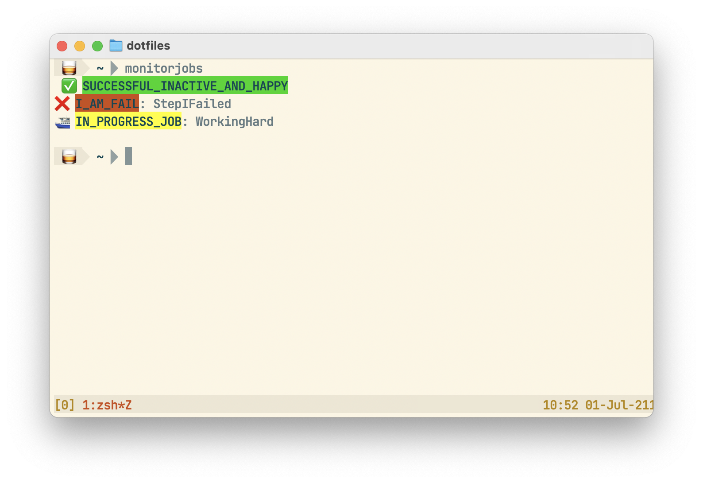

# monitorjobs

</img>

Shell script driven by your .aws/config and a few settings

## Installation

monitorjobs is a bash script, so putting it anywhere in your $PATH is all you really need to do!

You can also do `brew install flare576/scripts/monitorjobs`

## Setup

You will need
- [aws-cli](https://aws.amazon.com/cli/) setup and authenticated
- [jq](https://jqlang.github.io/jq/download/) installed
- $AWS_PIPELINE_PROFILE environment variable set (or use -p and pass in a profile name)
- If you have ZSH
    - export your list of jobs somewhere in your profile:
        ```
        export AWS_JOBS_LIST=(
                SUCCESSFUL_INACTIVE_AND_HAPPY
                I_AM_FAIL
                IN_PROGRESS_JOB
                )
        ```
- For other shells (or if you don't want to clutter your env):
    - you'll need to make a configuration file where each line is a project:
        ```
        SUCCESSFUL_INACTIVE_AND_HAPPY
        I_AM_FAIL
        IN_PROGRESS_JOB
        ```
      and include it in the call with -f
        ```
        monitorjobs -f /my/config/file
        ```
